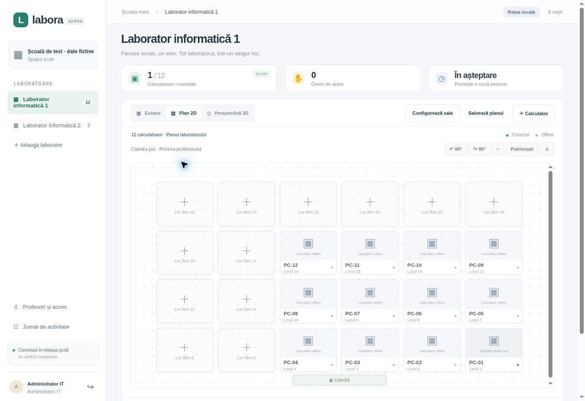

# Labora · 0.1.0 alpha

Aplicație desktop pentru laboratoare școlare Windows: administrare per școală,
laboratoare preconfigurate, PC-ul profesorului, ecrane live în LAN, asistență și
proiecție pe monitorul secundar / proiector / tabla smart.



**Stadiu: alpha pentru pilot tehnic. Nu este o versiune certificată pentru instalare
generală în școli.** Consultați [raportul de testare](docs/TESTING.md) pentru a
distinge testele executate de verificările care necesită calculatoare Windows.

## Funcții implementate

- Școala și administratorul se creează local la inițializarea serverului; nu există
  parole implicite, conturi demo sau date de elevi în surse.
- IT creează laboratoare, profesori și drepturi de acces; școlile și laboratoarele
  sunt filtrate și autorizate pe server, inclusiv pentru comenzile live.
- Înrolare cu token aleator, de unică folosință, valabil 15 minute. Rolul și
  laboratorul PC-ului sunt fixate de server, nu alese de elev.
- Panou în română, listă de ecrane și plan fizic al laboratorului. IT configurează
  rândurile și coloanele și lasă locuri libere pentru culoare / bănci fără PC.
  Drag-and-drop mută pe un loc liber sau schimbă două PC-uri între ele, fără
  suprapuneri. Alt + săgeți oferă aceeași funcție din tastatură.
- Rotire cu 90°, zoom și potrivire la fereastră. Pozițiile fizice NU se rearanjează
  când fereastra se îngustează: se adaptează scara planului. Vederea profesorului
  este memorată separat de configurația sălii. Modul 3D este o perspectivă vizuală,
  nu un editor volumetric 3D. Cererile de ajutor evidențiază locurile fizice.
- O oră activă per laborator, pornită de profesorul autentificat la un PC
  înrolat cu rol de profesor. Reconectarea nu reia automat ora profesorului.
- Captură a **ecranului principal**, WebRTC direct în LAN, fără serviciu cloud
  STUN/TURN, fără audio și fără înregistrarea ecranelor pe server.
- Transmisie de rezervă prin server: cadre JPEG de maximum 60.000 caractere,
  până la 2 fps. Sunt generate în timpul orei ca rezervă și afișate când fluxul
  WebRTC nu este disponibil. Imaginile expiră după 3 secunde fără actualizare;
  nu sunt salvate pe disc. Acest mod consumă trafic pe server.
- Buton de ajutor, mesaj profesor → elev, jurnal al operațiilor administrative,
  orei, preluării controlului și selecției pentru proiecție.
- Control Windows limitat la clic stânga/dreapta și taste simple, cu indicator
  vizibil. Nu există shell de la distanță, clipboard sau transfer de fișiere.
- Proiecție separată pe primul ecran secundar detectat; monitorul principal
  păstrează panoul profesorului. Fluxul proiecției alpha este actualizat la maximum
  10 cadre/s, prin cadre JPEG în memorie.
- Instalator NSIS per-machine; pornire la autentificarea utilizatorului prin
  HKLM Run. Setările din ProgramData sunt modificabile doar de administratori.
- Scripturi și workflow pentru generarea instalatorului Windows x64.

## Pornire pentru dezvoltare

Necesită Node.js 22+ și npm. Din rădăcina proiectului:

```sh
npm ci
npm run setup
npm run server
```

În alt terminal:

```sh
npm start
```

Fără înrolare locală, aplicația deschide modul de administrare IT. Introduceți
adresa serverului și contul creat prin `setup`, apoi creați laboratoarele.
Pentru a porni o oră este obligatorie înrolarea acelui PC ca **profesor**.

Serverul HTTP implicit este legat strict de `127.0.0.1`. Pentru LAN, configurați
HTTPS cu certificat valid pentru numele serverului și de încredere pe toate PC-urile.
Nu dezactivați verificarea TLS. Vezi [instalarea în școală](docs/DEPLOYMENT.md).

```powershell
$env:LABORA_HOST = '0.0.0.0'
$env:LABORA_TLS_CERT = 'C:\LaboraServer\certs\server.pem'
$env:LABORA_TLS_KEY = 'C:\LaboraServer\certs\server-key.pem'
$env:LABORA_DATA = 'C:\LaboraServer\data\store.json'
npm run server
```

## Înrolarea unui PC Windows

1. IT instalează Labora cu instalatorul per-machine.
2. În administrare: laborator → **Calculator** → nume și rol → generează cod.
3. IT deschide PowerShell ca administrator și execută:

```powershell
$code = Read-Host 'Codul de înrolare'
.\scripts\Enroll-Device.ps1 -ServerUrl 'https://labora.scoala.local:4310' -EnrollmentToken $code
Remove-Variable code
```

4. Redeschideți Labora în sesiunea utilizatorului obișnuit. PC-ul elevului se
   conectează automat; PC-ul profesorului cere autentificarea personală.
5. Conectați proiectorul sau tabla smart la PC-ul profesorului. Windows + P →
   **Extindere**. Funcția de proiecție cere un ecran secundar real.

Fișierul `C:\ProgramData\Labora\device.json` nu se publică pe GitHub. Configurația
include un secret de dispozitiv; acesta nu acordă drepturi de profesor sau IT.

## Testare și compilare

```sh
npm run check
npm test
npm audit --omit=dev
```

Testul integrat de UI folosește Chromium și cadre de test sintetice, marcate ca
atare, pentru WebRTC sau transportul de rezervă. Nu echivalează cu o captură de
 desktop Windows. Include verificări geometrice pentru plan la mai multe lățimi.

```sh
npx playwright install chromium
node tests/ui-integration.mjs
```

Compilare pe Windows cu .NET SDK 8:

```powershell
dotnet publish native/InputBridge/InputBridge.csproj -c Release -r win-x64 --self-contained true -o native/InputBridge/publish
npm run dist:win
```

Workflow-ul `.github/workflows/verify.yml` rulează testele și construiește un
instalator **nesemnat** ca artefact GitHub Actions. Nu publică automat Releases.
Pentru producție sunt necesare semnare cu certificatul organizației și testare
Windows pe dispozitive reale.

## Limite deliberate ale versiunii

- Conturi locale administrate de școală; **Microsoft/Google SSO și MFA nu sunt
  încă implementate**. Nu există un cont comun recomandat pentru profesori.
- Aplicația utilizatorului poate fi oprită din Task Manager. ACL-urile protejează
  setările, nu fac agentul imposibil de oprit. Un serviciu de supraveghere și
  politici GPO/Intune trebuie implementate și validate pentru o lansare gestionată.
- Autostart are loc după autentificarea în Windows, nu oferă captură a ecranului
  de login sau a desktopului securizat UAC. Elevii trebuie să aibă conturi standard.
- Captura vizează numai monitorul principal. Nu există încă selector multi-monitor.
- 15 fps ceruți pentru captură (maximum 20); performanța efectivă depinde de PC-uri,
  codecuri și rețea. Nu promitem latență zero sau disponibilitate de 100%.
- Modul de rezervă este potrivit pentru urmărire și ajutor de bază, nu pentru
  video fluid. Necesită măsurători de trafic și CPU la numărul real de PC-uri.
- Controlul nu include drag, scroll, combinații de taste, desktop UAC sau privilegii
  administrative. Nu este un înlocuitor complet pentru un produs de remote desktop.
- Nu sunt implementate alerte de navigare, extensie browser, inventar de aplicații,
  streaming profesor → toate PC-urile, actualizări automate sau înregistrări video.
- Baza JSON are un singur proces scriitor; potrivită pilotului local, nu HA.
- Configurația serverului, certificatul și politica firewall sunt responsabilitatea
  IT; aplicația nu deschide porturi publice și nu ocolește izolarea rețelei.

## Structură

`server/` autentificare, persistență, autorizare și semnalizare.
`desktop/` Electron, IPC restrâns, captură și UI.
`native/InputBridge/` intrare mouse/tastatură Windows.
`scripts/` inițializare, înrolare și instalator.
`tests/` verificări server și UI integrat.
`docs/` instalare, securitate și testare.

Cod proprietar, fără licență open-source acordată implicit.
